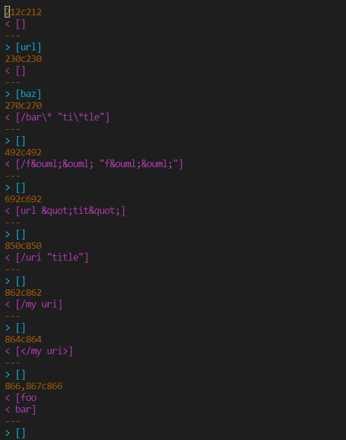
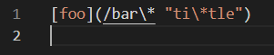
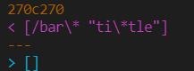
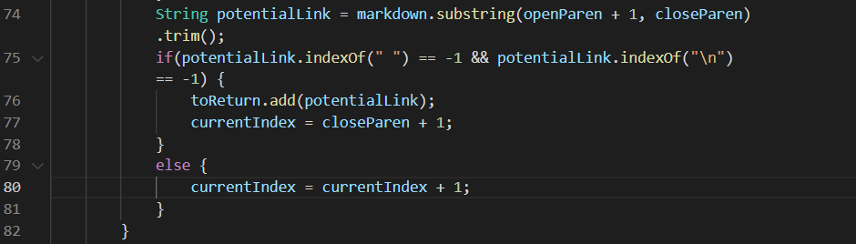
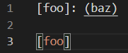
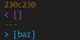
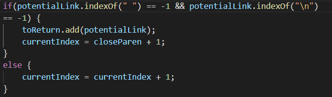

# Lab Report 5
Will Luo, jil232@ucsd.edu, A169898083

## **Find the Difference**
I used `diff` command to find the difference between two markdownparse java files. The number in brown indicates the line in the actual results file, so I go to each results file to find out which test case on that line is causing such difference. 

Here is the result:

 

## **First Test**
The first test is `22.md` located in line 270, and the file is:

 

The first line is the result of my code, and the next line is the result of the instructor's code:

As we can see, the output should be `/bar\* "ti\*tle"` for `MarkdownParse.java`. My MarkdownParse file produces the correct output; the instructor's file has no output, so it is incorrect as well.

The problem with the instructor's code is that the code detects a space in the potential link in parenthesis, so it skips over this link and moves on to the next loop. I think the code can be fixed by removing this statemetn of checking space.

## **Second Test**
The second test is `201.md` located in line 230, and the file is:

 

The first line is the result of my code, and the next line is the result of the instructor's code:

As we can see, there should be no output for `MarkdownParse.java`. My MarkdownParse file produces no output, so this is correct; the instructor's file produces `baz`, so it is incorrect.
The problem is that the instructor's file does not check if openParenthesis' index is right after closeBracket's index. The code should check `if(openParen - 1 == nextCloseBracket)`. 

